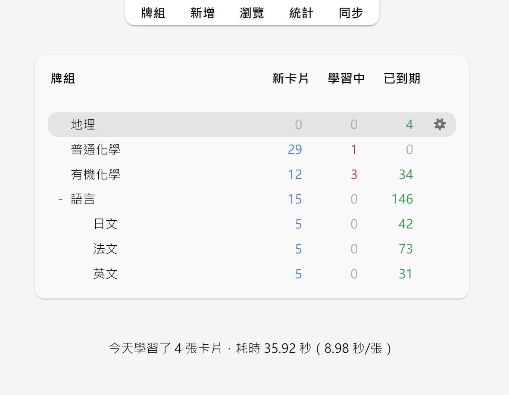

# 學習 [Studying（原文）](https://docs.ankiweb.net/studying.html)

<!-- toc -->

加入牌組或筆記後，方可開始學習。

## 牌組

開始學習時，Anki只會從所選牌組及其子牌組中「收集」（抽取）卡片。

牌組畫面中是你的牌組及當天需要學習的[「新卡片」、「學習中」和「已到期（待複習）」](getting-started.md#卡片狀態)的卡片數量。

你可以按一下牌組來前往學習畫面，按一下主視窗上方的「牌組」按鈕來回到牌組清單。（要使用鍵盤切換，請使用選單中的「學習牌組…」動作，或按下 <kbd>S</kbd> 鍵來開始學習所選牌組）

按一下牌組右邊的設定按鈕可以更改[牌組選項](deck-options.md)，重新命名、刪除或[匯出](exporting.md)牌組。

## 學習概覽

按一下要學習的牌組後，打開的「牌組概覽」畫面上會顯示今天需要學習的卡片數量：

卡片分為[三種狀態](getting-started.md#卡片狀態)：新卡片、學習中和待複習。在牌組選項中啟用「[推遲關聯的 ... 卡片](#關聯卡片和推遲-siblings-and-burying)」後，還可以看到將被推遲的卡片數量，以灰色數字顯示：

按一下「**開始學習**」按鈕將顯示當天應學的所有卡片。

在學習中，可以在鍵盤上按下 <kbd>S</kbd> 鍵以返回概覽畫面。

## 問題面

顯示卡片問題面、思考、答題過後，你可以按一下「**顯示答案**」按鈕或按下 <kbd>空白</kbd> 鍵來顯示答案面。答題無須限時，但建議將答題時間保持在10秒內，超時則直接放棄作答並檢查答案，不要埋頭苦想。

## 回答按鈕

顯示答案後，請對比你的回答和正確答案，然後在以下按鈕中選擇一個。

- **重來**：表示答錯或完全想不出答案。部分答對時也仍應選擇此按鈕——如果答案在考試時會被判為錯誤，那麼請在Anki中也視為錯誤。此按鈕的使用頻率通常應為5–20%。

  鍵盤快速鍵：<kbd>1</kbd>

- **困難**：表示答對，但作答時猶豫不決或耗時過長。

  鍵盤快速鍵：<kbd>2</kbd>

- **良好**：表示答對，但需要些許思考才能想出答案。恰當使用Anki時，此按鈕應為最常使用的按鈕，使用頻率通常應為80–95%。

  鍵盤快速鍵：<kbd>3</kbd>、<kbd>空白</kbd>、<kbd>Enter</kbd>

- **簡單**：表示答對，且作答時不假思索。

  鍵盤快速鍵：<kbd>4</kbd>

若難以在四個按鈕中做出選擇，你可以只用兩個按鈕：答錯按「**重來**」，答對按「**良好**」。

選擇按鈕後，卡片將在所選按鈕上顯示的時長過後再次出現。若要進一步了解複習間隔設定，請參閱《牌組選項》中的〈[學習階段](deck-options.md#學習階段)〉、〈[遺忘](deck-options.md#遺忘-lapses)〉、〈[FSRS](deck-options.md#fsrs)〉及〈[進階](deck-options.md#進階選項-advanced)〉各章節。

## 模糊乘數

選擇回答按鈕的同時，Anki會為複習卡隨機套用一個模糊乘數，從而使每張卡片稍微錯開。這樣，若你在相同時間為兩張卡片按下相同按鈕，這兩張卡片在未來就不會一直同時出現。

學習中的卡片也會被賦予最長5分鐘的額外延遲，以避免出現順序相同，但這一延遲不會體現在回答按鈕上。此功能無法被停用。

## 「編輯」與「更多」

你可以按一下左下方的「**編輯**」按鈕來編輯當前筆記。編輯結束後可繼續學習。編輯畫面與[新增筆記](editing.md)畫面非常相似。

右下方的「**更多**」按鈕提供了更多可為當前卡片或筆記執行的動作。

- [**為卡片加上旗標**](editing.md#使用旗標-using-flags)：為卡片加上或移除一個以顏色區分的標記。旗標會在學習時顯示，在瀏覽器中也可以搜尋加上了旗標的卡片。現在在忙，想晚點再詳細查詢一個單字？你可以先給它加上旗標。在Anki 2.1.45+ 版本中，你還可以在[瀏覽器](browsing.md)中重新命名旗標。

- **推遲卡片/筆記**：停止複習一張卡片或一則筆記中的所有卡片，第二天再複習。（若要提前取消推遲，可以在[學習概覽](studying.md#學習概覽-study-overview)畫面按一下「取消推遲」按鈕）。若你當下無法回答某些卡片，或想改時間再學習，則可以使用這個動作。推遲也可以[自動套用](studying.md#關聯卡片與推遲-siblings-and-burying)到同一則筆記的卡片。

- **重置卡片**：移動當前卡片到[新卡片佇列末尾](browsing.md#cards)。

  在Anki 2.1.50+ 版本中，使用v3排程器第一次學習新卡片時，Anki會記住卡片的原始順序。在遺忘卡片時可使用「回復原始順序」選項來回復卡片到原始順序。

  如果啟用了「重設重複和遺忘次數」選項，卡片的複習和失敗次數將被重設為零。卡片資訊底部的複習歷史記錄不會被移除。

- **設定到期日**：將卡片加入複習佇列，並[使其在指定日期到期](browsing.md#cards)。

- **擱置卡片/筆記**：停止複習一張卡片或一則筆記中的所有卡片，直到手動取消擱置（透過瀏覽器中的擱置按鈕）。若你在短期內都不想要複習一則筆記，但又不想刪除，則可以使用此動作。使用舊版排程器時，若卡片在學習時就被擱置，卡片會回到擱置前原來的新卡片或複習佇列。

  使用 [2.1排程器](https://faqs.ankiweb.net/the-anki-2.1-scheduler.html)時，擱置卡片不會重置其學習階段。

- **選項**：編輯當前牌組的[選項](deck-options.md)。

- **卡片資訊**：顯示卡片的[統計資料資訊](stats.md#card-info)。

- **上一張卡片資訊**：顯示上一張卡片的[統計資料資訊](stats.md#card-info)。

- [**標記筆記**](editing.md#Marked標籤-the-marked-tag)：為當前筆記加入「marked」標籤，以便在瀏覽器中尋找。類似為卡片加上旗標，但透過標籤實現，若一則筆記有多張卡片，則這些卡片全都會帶有「marked」標籤。建議大多數使用者使用旗標。

- **建立複本**：開啟編輯器，[重複](browsing.md#finding-duplicates)當前筆記的內容，你可以稍作修改來建立圍繞同一主題的不同卡片。根據預設，複本會與原筆記放入同一牌組。

- **刪除筆記**：刪除筆記及其所有卡片。

- **重播音訊**：若卡片正面或背面有音訊，重新播放。

- **暫停音訊**：若音訊正在播放，暫停播放。

- **音訊倒轉5秒/快轉5秒**：倒轉/快轉正在播放的音訊5秒。

- **錄音**：使用你的麥克風錄音來檢查你的發音。一旦前進到下一張卡片，錄音就會被刪除。若要將音訊永久加入卡片，請編輯筆記。

- **重播錄音**：重新播放你的上一個錄音（如顯示答案後）。

## 顯示順序

學習時，顯示的卡片會從你選取的牌組及其子牌組中抽取。因此，若選取學習牌組「日文」，則子牌組「日文::單字」和「日文::課本::第一課」中的卡片也會一併顯示。

根據預設，Anki收集（抽取）新卡片依牌組名稱的字母順序收集。如果你選取學習牌組「French」，包括子牌組「French::Vocab」和「French::My Textbook::Lesson 1」，那麼卡片收集順序將為「French」→「My Textbook」→「Vocab」。你可以利用這個特性來控制卡片出現的順序，把優先級高的卡片放入在清單中靠上的牌組。依字母順序排序時，「-」會出現在字母前，「\~」會出現在字母後。因此，若要讓「Vocab」排在最前面，你可以把它重新命名為「-Vocab」；要讓「My Textbook」排在最後則可以把它重新命名為「\~My Textbook」。

Anki會分開收集新卡片和複習卡，分成兩佇列。所以若你學完了A牌組的新卡片但未學完複習卡，A牌組的複習卡和B牌組的新卡片可能會同時出現。若要避免此情況，你可以直接選取要單獨學習的子牌組，而不是其母牌組。

由於學習中的卡片需要儘早完成，Anki會同時從所有牌組中收集這些卡片，並依到期順序顯示。

要了解如何控制卡片顯示順序，請參閱《牌組選項》中的〈[顯示順序](deck-options.md)〉章節。要對新卡片的順序微調，請在[瀏覽器](browsing.md)中進行調整。

## 關聯卡片與推遲

還記得Anki可以為你輸入的[單項內容建立多張卡片](getting-started.md)嗎？例如同時建立一張「正面→背面」和一張「背面→正面」卡片，或是一段文字中建立兩個克漏字空格並產生兩張卡片。像這樣的一組卡片叫做「關聯卡片」。

當你回答的卡片存在關聯卡片時，Anki可以自動「推遲」這些卡片，防止關聯卡片在同一次學習中一起出現。被推遲的卡片次日才會出現；你也可以按一下[牌組概覽](studying.md#學習概覽)畫面下方的「取消推遲」按鈕來手動取消推遲。關聯卡片牌組不同時（例如使用「[覆蓋牌組](templates/intro.md)」功能時）也仍會被推遲。

你可以在[牌組選項](deck-options.md)畫面中開啟推遲選項，可對新卡片和複習卡分別進行設定。

Anki僅會推遲關聯的新卡片或複習卡。學習中的卡片（未學完的新卡片）應儘早完成學習，因此不會被推遲；但反過來，回答學習中的卡片後，關聯的新卡片或複習卡仍會被推遲。

卡片無法同時被推遲和擱置。擱置卡片時，已推遲的卡片將被取消推遲。已擱置的卡片無法被推遲。

## 快速鍵

Anki中大多數的常用動作都可以使用快速鍵來操作。其中大多可在介面中找到：選單項目旁邊標有快速鍵，滑鼠遊標懸停在按鈕上時通常會顯示快速鍵提示。

學習時，按下 <kbd>空白</kbd> 鍵或 <kbd>Enter</kbd> 鍵會顯示答案。顯示答案面時，按下 <kbd>空白</kbd> 鍵或 <kbd>Enter</kbd> 鍵會選取「良好」按鈕。使用數字鍵 <kbd>1</kbd> 至 <kbd>4</kbd> 可以選取各難度按鈕。常用的方法是用一根手指按 <kbd>空白</kbd> 鍵來回答大多數卡片，另一根手指放在 <kbd>1</kbd> 鍵上以便遺忘時選取「重來」。

要使用鍵盤來快速切換牌組，你可以使用 <kbd>/</kbd> 鍵來選取「工具」選單中的「學習牌組」項目。打開的視窗中會顯示你的所有牌組。你可以在上方的篩選器中輸入文字來篩選牌組。要搜尋多個字詞，請在字詞間加入空格，Anki會顯示符合所有字詞的牌組。搜尋「日 單」或「字 日」都會符合名為「日文::單字」的牌組。

## 進度落後

當你的複習進度落後時，根據預設，Anki會優先顯示最早到期的卡片。這樣可以確保沒有卡片會被遺漏，遲遲複習不到。但如果你新學習了新卡片，學習中的卡片在學完積壓的複習卡之前都不會出現。

如果回答卡片時與上一次複習時的間隔過久，這一時長會幫Anki決定卡片下一次出現的時機。所以，當你有一段時間沒用Anki後，重新開始時只需正常繼續學習，無需從頭開始。
